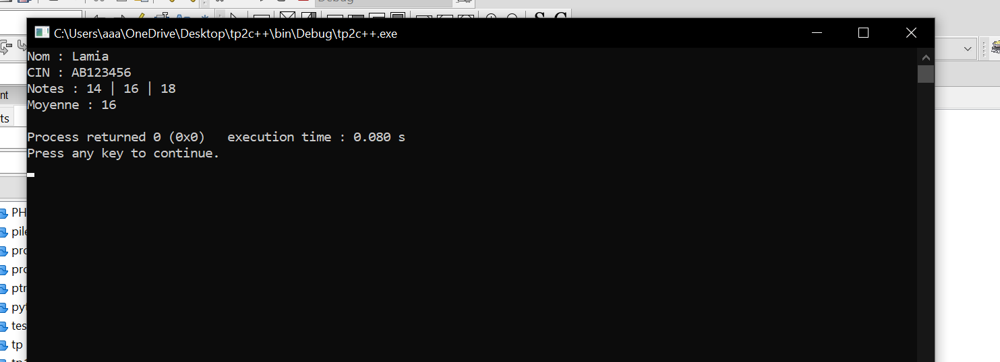
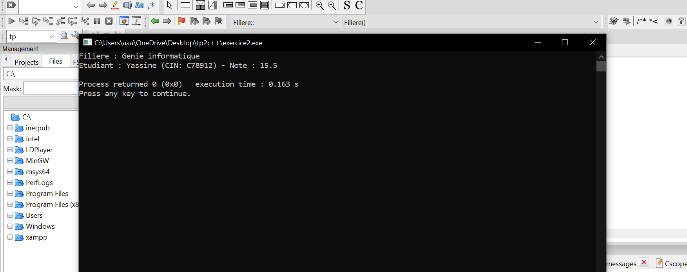

"captures d'ecrants du tp 2 "
# 🧠 TP3 - Programmation C++

Ce projet contient les exercices du TP3 en C++.

## 📸 Captures d’écran

Voici les résultats d’exécution :




---

## ⚙️ Compilation
```bash
g++ main.cpp -o main
./main
